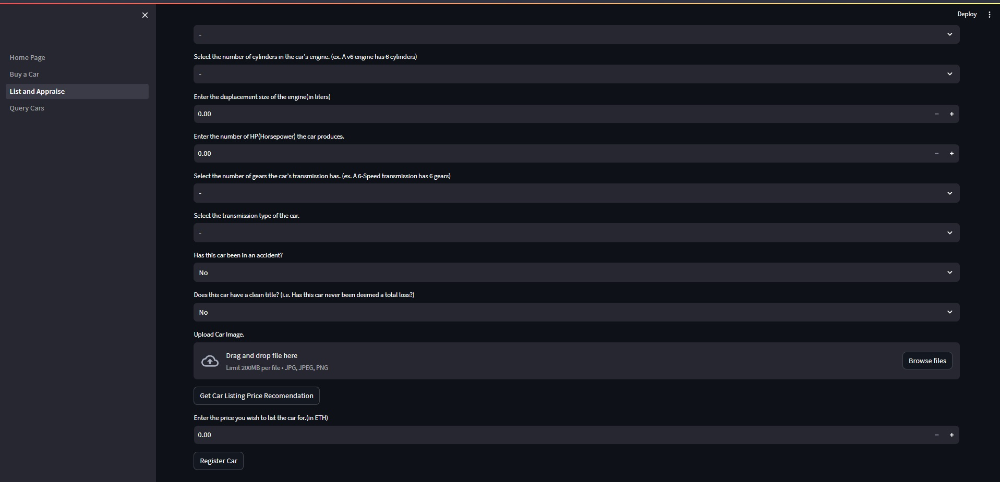

# Blockchain Car Marketplace

## **Team 2 - Project 3**

### Andy Vu
### Sophie-Pearl Degain 
### Abili Onyepunuka
### Alex Melino
#
#

## **Overview**

For the capstone Fintech project, we have decided to create a car marketplace hosted on the Ethereum blockchain which also incorporates machine learning. The marketplace will allow for a user to register a car to be sold (with a photo), view a list of currently available cars for purchase, and purchase a car. 

In addition, when registering a car for sale, the user will have the ability to call on a pre-trained machine learning model to provide a recommendation for what the sale price should be. 

The machine learning model is trained on a dataset of information and prices of over 4000 used cars (dataset obtained from https://www.kaggle.com, dataset populated with data from https://www.cars.com). A .csv file with the original dataset can be found in *'predictions/data/used_cars.csv'*.

The backend of the project uses Ganache to generate the Etheruem sandbox in which the smart contract is deployed. The smart contract was deployed using Remix Ethereum IDE, and the front-end of the application is run with Streamlit.
#
#

## **Repository Structure**

The strealit application is executed by running the *'Home_Page.py'* file. The additional pages of the streamlit application each have their own .py file located in the *'pages'* folder. The *'sample.py'* file is used to populate the blockchain with car entries for the purpose of demonstration only.

The smart contract can be found in the *'contracts'* folder under the name *'car-marketplace.sol'*. 

The machine learning Jupyter Notebook file can be found in the *'predictions'* folder under the name *'used_cars_price_prediction.ipynb'*. Also, the model itself can be found in the *'saved_models'* folder, and the *'prediction.py'* file in the main folder contains the predictive machine learning function.
#
#

## **Machine Learning**

The machine learning model used in this project is trained on a dataset of information and prices of over 4000 used cars. The dataset was obtained from https://www.kaggle.com, and the dataset is populated with data from https://www.cars.com. 

The dataset was cleaned, encoded, split into training and testing sets, and then used to evaluate the effectiveness of various machine learning models.

The machine learning model which produced the best results was the Gradient Boosting Regressor. The model was then saved to be used by the *'prediction.py'* This file defines the predictive function which is used by the front-end Streamlit application.
#
#

## **Smart Contract**

The smart contract (*'contracts/car-marketplace.sol'*) defines the structure of a 'car' object and initializes various functions and events needed for the blockchain marketplace to function. The functions are needed to 'mint' each new car entry as an NFT and to transfer ownership of each car token when a purchase is made. The smart contract is compiled and deployed to the Ganache/Ethereum blockchain using the Remix IDE. The contract is ERC721 compatible. 
#
#

## **Functionality**

The Blockchain Car Marketplace uses a home page, which connects to three other Streamlit pages, one for listing a car for sale and obtaining an appraisal, one for querying availble cars already on the blockchain, and one for purchasing a car.
#

Streamlit home page with a haeding, banner image, and links to other pages on the sidebar
#
#

Listing and appraisal page, to take in the user's address and allows the user to upload their car's info and a photo and tokenizes it and adds it to the smart contract. This page also has a button for the user to generate an appraisal based on a trained machine learning model. Above is a screeshot of an empty form.
#
#

This page allows the user to query all tokenized cars currently registered with the smart contract by seraching through their token id's. The car's information and links to its photo can be viewed as seen in teh screenshot above. Note that there is an attribute in the car's information, 'For Sale:' which indicates if the car is still available for purchase.
#
#

Above is a screenshot of the 'buy' page, where the user can input their ethereum address and then chose which car they would like from the list. Once the 'Buy Car' button is pressed, the token is transferred to the user's address and the price in ether is pulled from the user's account and sent to the original sellers's account.
#
#